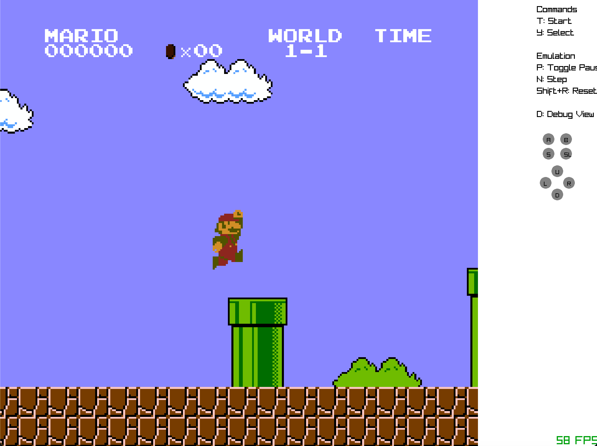
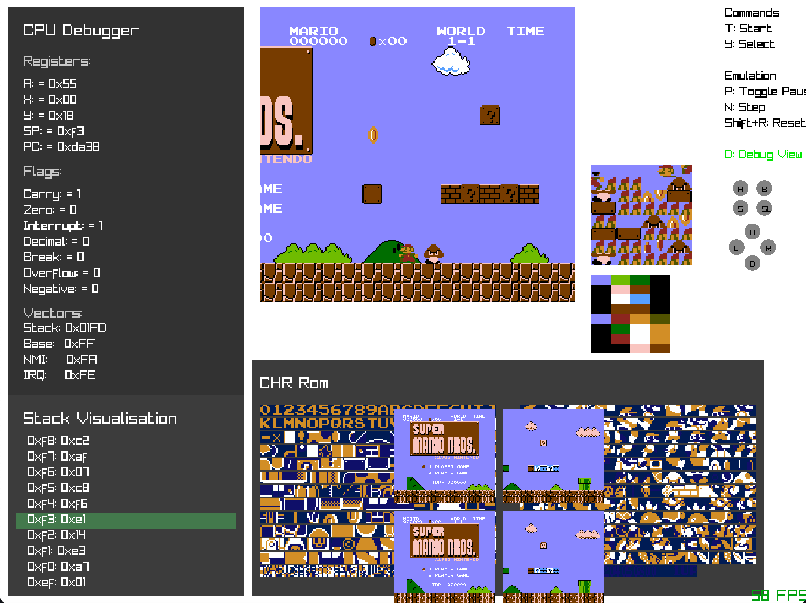

# ZNES ✨ - A NES / 6502 Emulator in Zig

[](https://ziglang.org/) [](LICENSE) **ZNES** is a Nintendo Entertainment System (NES) emulator focused simplicity, and leveraging the power of the [Zig programming language](https://ziglang.org/). It aims to provide a clean codebase for learning about NES internals and 6502 assembly, while also being a functional emulator for playing classic games.

## 📸 Screenshots

|                     Gameplay Example                      | Debugger Interface              |
|:---------------------------------------------------------:| :-----------------------------: |
| |  |
|                    *Super Mario Bros.*                    | *CPU & Memory Debug View* |

## ✨ Features

* **Cycle-Accurate 6502 CPU Emulation:** Striving for accurate emulation of the MOS Technology 6502 processor (Ricoh 2A03 variant for NES).
* **PPU (Picture Processing Unit) Emulation:** Handles rendering, sprites, background tiles, palettes, and scrolling.
* **Basic APU (Audio Processing Unit) Emulation: (WORK IN PROGRESS)** (Optional: Add if you have sound, otherwise state as TODO/Planned) Basic sound channel support.
* **Controller Support:** Handles standard NES controllers (Player 1).
* **Mapper Support:**
    * ✅ **Mapper 0 (NROM):** Supported. (Used by many early/simple games like *Super Mario Bros.*, *Donkey Kong*)
    * ✅ **Mapper 1 (SxROM / MMC1):** Supported. (Used by games like *The Legend of Zelda*, *Mega Man 2*, *Metroid*)
* **Debugging Tools:** Essential for development and understanding NES behaviour.
    * Pause / Resume / Frame Advance execution.
    * **CPU Inspector:** View registers (A, X, Y, PC, SP, P), current instruction, and cycle count.
    * **Memory Viewer:** Inspect CPU memory space ($0000 - $FFFF), including RAM, PPU registers, APU registers, and cartridge space.
    * **PPU Inspector:** View PPU registers, scanline/cycle info, sprite evaluation details.
    * **Nametable Viewer:** Visualize the background layout data.
    * **Pattern Table Viewer:** Display the CHR ROM/RAM tiles (background and sprite graphics).
    * **Step by step execution:** Execute one instruction at a time to inspect CPU state.
    * **(Planned):** Breakpoints, Audio channel viewer.
* **Drag & Drop ROMS:** Drag and drop `.nes` files onto the window to load them.
* **Cross-Platform (Goal):** Aims to run on Windows, macOS, and Linux. (Requires platform layer abstraction, e.g., using SDL2 or a custom backend).
* **Written in Zig:** Leverages Zig's features for safety, performance, and maintainability (e.g., `comptime`, explicit memory management).

## 🔧 Installation

**1. Pre-compiled Binaries (Recommended)**

Ready-to-run executables for Windows, macOS, and Linux are available on the [Releases Page](https://github.com/Alfagov/ZNES/releases). Download the appropriate archive for your operating system and extract it.

**2. Building from Source**

If you prefer to build ZNES yourself, you'll need:

* **Zig Compiler:** Version `0.14.x` or later (check the badge above for the recommended version). Installation instructions: [Ziglang Download](https://ziglang.org/download/)
* **Git:** To clone the repository.

**Steps:**

```bash
# 1. Clone the repository
git clone https://github.com/Alfagov/ZNES.git
cd ZNES

# 2. Build the project
#    - Standard debug build:
zig build

#    - Optimized release build:
zig build -Doptimize=ReleaseFast # Or ReleaseSafe

# 3. Run the emulator (from the project root)
#    The executable will likely be in ./zig-out/bin/
./zig-out/bin/ZNES
```

## 🚀 Usage

**Command Line:**

```bash
ZNES
```

**Drag & Drop:**
You can drag and drop `.nes` ROM files onto the ZNES window to load them.

**Default Keybindings:**

* **D-Pad:** Arrow Keys
* **A Button:** A
* **B Button:** B
* **Select:** Y
* **Start:** T
* **Pause/Resume:** P
* **Frame Advance (while paused):** N
* **Toggle Debugger:** D
* **Reset:** SHIFT+R

## 🛠️ Debugging

ZNES includes built-in debugging tools to help inspect the emulator's state:

1.  **Pause:** Press the `Pause` key (default: `P`) during emulation.
2.  **Toggle Debugger:** Press the `Toggle Debugger` key (default: `D`) to show/hide the debug panels.
3.  **Frame Advance:** While paused, press the `Instruction Advance` key (default: `N`) to execute a single instruction.

The debug interface typically includes views for:

* **CPU State:** Registers, flags, current instruction.
* **Memory:** A hex editor view of the CPU's address space.
* **PPU State:** Scanline, cycle, registers, sprite info.
* **Nametables:** Visual representation of the background maps.
* **Pattern Tables:** Visual representation of the graphics tiles (CHR).

## 🗺️ Supported Mappers

The NES used different hardware "mappers" in its cartridges to expand capabilities (more memory, bank switching, scanline counters). ZNES currently supports:

* **Mapper 0 (NROM):** The most basic mapper. No bank switching for PRG ROM (program code), optional CHR RAM (character graphics RAM). Supports 16KB or 32KB PRG ROM and 8KB CHR ROM/RAM.
    * *Examples: Super Mario Bros., Donkey Kong, Excitebike, Ice Climber*
* **Mapper 1 (MMC1 / SxROM):** A common early mapper featuring PRG ROM/RAM bank switching, CHR ROM/RAM bank switching, and mirroring control.
    * *Examples: The Legend of Zelda, Metroid, Mega Man 2, Castlevania II*

Support for more complex mappers like **MMC3 (Mapper 4)** is planned for future releases.

## 🙏 Acknowledgements

* The [Zig Programming Language](https://ziglang.org/) community.
* The incredible resources at [NESDev Wiki](https://www.nesdev.org/wiki/).
* [Emulator101](http://emulator101.com/) for foundational emulation concepts.
---

*Happy Emulating!*
